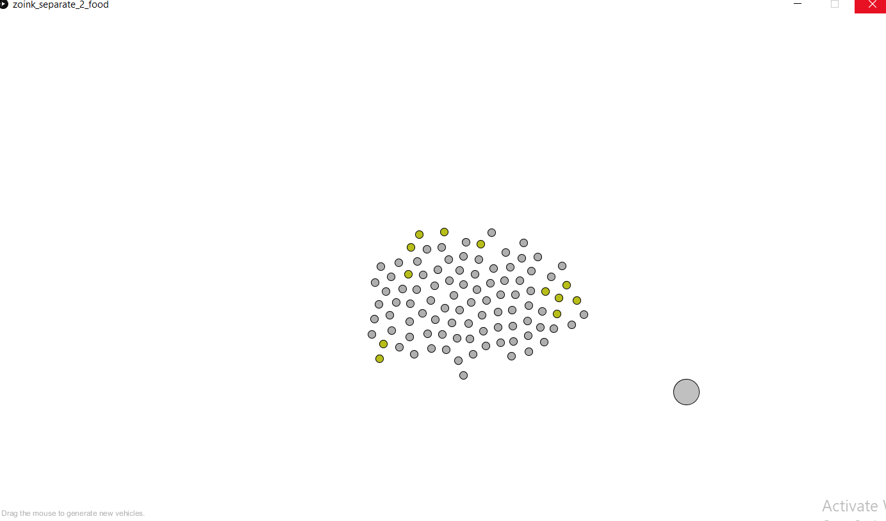

# Midterm Project - *Behaviours*

## Chinonyerem Ukaegbu

**Description**

The task was to develop a more complex ecology, either continuing with what was created for February 14, or creating a new ecology. Incorporate various behaviors such as following a flow field, attraction, aggression, arriving, cohesion, separation, and flocking.

**Inspiration**

The names of the character as well as the colors used to depict them were drawn from the hit TV series Scooby Doo. The behaviours were inspired by a combination of real life systems as well as imagined ones.

**Concept**

This project is a depiction of a made up ecosyste, consisting of three creatures: the zoinks, jinkies and jeepers. Alongside the living creatures, there exists the food particles present in the ecosystem as well as an incubator.

The initial concept I had planned for the project can be found in [this section](https://github.com/ChinoUkaegbu/RobotaPsyche/blob/main/midterm/journal.md#27th-february-2022) of the journal. Most of the ideas were implemented with a couple of modifications which I will go into detail about below.

+ Zoinks
   - Description: circular in shape. Small in size and are either grey or lemon green depending on the amount of stored food.
   - Food hunters of the ecosystem. Are designed to seek for the objects of the food class.
   - Store food gathered and share with the jinkies.
   - Are the only creatures capable of breeding.
   - Can be eaten by the jeepers if they collide.

+ Jeepers
   - Description: triangular in shape. Larger in size and purple at all times.
   - Predators of the ecosystem. However, they hunt only the zoinks and do not eat the food particles either.
   - Are repelled by each other.

+ Jinkies
   - Description: elliptical in shape. Smaller in size than the jeepers and are either red or pink depending on the amount of food they've eaten
   - Defenders of the zoinks. Have a symbiotic relationship with the zoinks as they are unable to hunt for food and so they rely on the zoinks for nutrition and protect them by repelling the jeepers.
   - Are randomly dispersed across the ecosystem and only move vertically downwards.

+ Food
   - Description: circular in shape. Larger in size than the zoinks and are light pink at all times.
   - Source of nutrition for the zoinks. One particle is capable of feeding at most two zoinks before it is depleted.
   - At most two food particles in the ecosystem at a given time.
   - Only move vertically downawards.

+ Incubator
   - Description: rectangular in shape. Stationary and located at the far right of the ecosystem. Alternates between grey and a dark purple depending on whether it's in use or not.
   - Facilitate breeding among the zoinks only when population drops below a certain threshold.

**Implementation**

The creatures and non-living parts of implemented as individual classes. In addition to the zoinks seeking after the objects of the Food class. The zoinks also exhibit separation and so while they move together while hunting for food particles, there is a distance between each zoink as shown below

**Difficulties**

+ **Initializing attraction and repulsion:**\
I really wanted the tuna to actually move together like as one huge school but I couldn't really figure out what values to initialize the strength of the attract() method with. In the end, I just went with the gravitational force we used in class because I felt like the behaviour was satisfactory so they don't really move as one uniform mass but they just kind of move...together?. Now that i think about it, if they had been moving as one mass, they would have been eaten quite quickly by the sharks. Or maybe they would have reproduced too quickly. Also for the repulsion of the sharks, I ended up going with a constant value after I experimented.

+ **Detecting when objects were colliding:**\
It turns out that collision detection using triangles is very...stressful (compared to working with circles at least). I actually couldn't end up figuring this bug out completely and so sometimes the fishes disappear when they're close to the shark (not necesarily overlapping with the shark) but I was able to modify the eat() method so that the margin of error isn't so bad.

+ **Detecting when 2 tuna are in the incubator:**\
I wanted the new tuna to be spawned only when 2 tuna were in the incubator at the same time but I found it a bit tricky so now we have this sort of system where fish 1 drops the eggs in the incubator and after fish 2 takes care of the egg until it's ready to be added to the array list. This is probably not biologically accurate but well...

**Possible Improvements**

+ Reducing margin of error for collisions
+ Smoother transition from light stage to dark stage

**Photos of Project**

[Link to Video](https://youtu.be/xJ4EKzne_9Y)

**Conclusion**

This was a really cool project to do and I really enjoyed it. It was really nice thinking up the rules and implementing them and even having to modify them was quite the learning experience.

**Clever Things I Learned**

+ I realized that allong the way< I was creating classes depending on what I observed the ecosystem needed. For instance when the sharks were eating the tuna too quickly, I introduced the fishermen hooks and when I noticed that the tuna were still dying quickly, I introduced the incubator to spawn more fishes. I think the flexibility was really cool, it was kind of like building my own miniature city.
