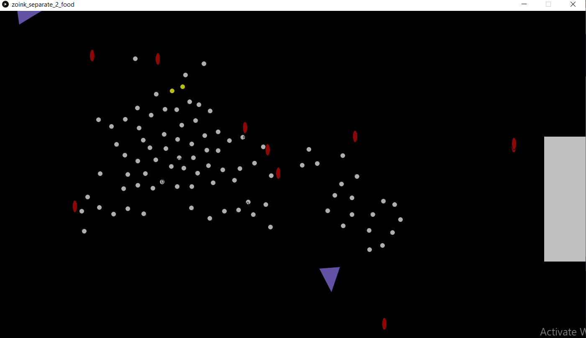
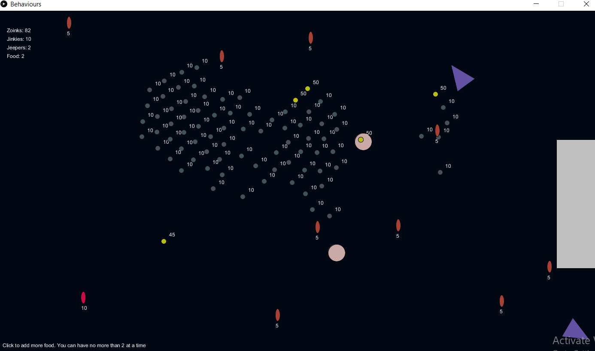

# Midterm Project - *Behaviours*

## Chinonyerem Ukaegbu


**Description**

The task was to develop a more complex ecology, either continuing with what was created for February 14, or creating a new ecology. Incorporate various behaviors such as following a flow field, attraction, aggression, arriving, cohesion, separation, and flocking.

**Inspiration**

The names of the character as well as the colors used to depict them were drawn from the hit TV series Scooby Doo. The behaviours were inspired by a combination of real life systems as well as imagined ones.

**Concept**

This project is a depiction of a made up ecosystem, consisting of three creatures: the zoinks, jinkies and jeepers. Alongside the living creatures, there exists the food particles present in the ecosystem as well as an incubator.

The initial concept I had planned for the project can be found in [this section](https://github.com/ChinoUkaegbu/RobotaPsyche/blob/main/midterm/journal.md#27th-february-2022) of the journal. Most of the ideas were implemented with a couple of modifications which I will go into detail about below.

+ Zoinks
   - Description: circular in shape. Small in size and are either grey or lemon green depending on the amount of stored food.
   - Food hunters of the ecosystem. Are designed to seek for the objects of the food class.
   - Store food gathered and share with the jinkies.
   - Are the only creatures capable of breeding.
   - Can be eaten by the jeepers if they collide.

+ Jeepers
   - Description: triangular in shape. Larger in size and purple at all times.
   - Predators of the ecosystem. However, they hunt only the zoinks and do not eat the food particles either.
   - Are repelled by each other.

+ Jinkies
   - Description: elliptical in shape. Smaller in size than the jeepers and are either red or pink depending on the amount of food they've eaten
   - Defenders of the zoinks. Have a symbiotic relationship with the zoinks as they are unable to hunt for food and so they rely on the zoinks for nutrition and protect them by repelling the jeepers.
   - Are randomly dispersed across the ecosystem and only move vertically downwards.

+ Food
   - Description: circular in shape. Larger in size than the zoinks and are light pink at all times.
   - Source of nutrition for the zoinks. One particle is capable of feeding at most two zoinks before it is depleted.
   - At most two food particles in the ecosystem at a given time.
   - Only move vertically downawards.

+ Incubator
   - Description: rectangular in shape. Stationary and located at the far right of the ecosystem. Alternates between grey and a dark purple depending on whether it's in use or not.
   - Facilitate breeding among the zoinks only when population drops below a certain threshold.


**Implementation**

The creatures and non-living parts of implemented as individual classes. In addition to the zoinks seeking after the objects of the Food class. The zoinks also exhibit separation (modified [code](https://github.com/nature-of-code/noc-examples-processing/tree/master/chp06_agents/NOC_6_07_Separation) from Dan Shiffman) and so while they move together while hunting for food particles, there is a distance between each zoink as shown below


The zoinks have two variables responsible for managing food hunting. The ```store_empty``` variable is of boolean data type and is responsible for keeping track of whether a zoink has fed (set to false) or not (set to true). The ```food_stored``` variable is of integer data type and keeps track of the value of food the zoink has at any given moment in time.

For the jinkies, they repel the jeepers that come near them in a bid to protect the zoinks. Furthermore, the section of code responsible for the sharing of food with the zoinks is as follows

```js
  //function to feed from a zoink that it collides if the zoink's food level hasn't dropped below 10 and if the jinkie is able to feed
  void feedFrom(Zoink z) {
    if (dist(location.x, location.y, z.location.x, z.location.y)<((mass*8)+z.r))
    {
      if ((z.stored_food>10) && (can_feed==true)) {
        stored_food+=5;
        z.stored_food-=5;
        can_feed = false;
      }
    }
  }
}
```

However, every 20 seconds, the stored_food variable for the jinkies is reset and so they need to constantly get food from the zoinks.

The incubator works in the same way as it did in the [February 14 project](https://github.com/ChinoUkaegbu/RobotaPsyche/tree/main/February14) with the modification of only being active when the population size drops below a certain threshold.

**Difficulties**

+ **Repulsion**\
The jinkies are implemented to repel the jeepers. However, there was no attraction or repulsion between the jinkies and so no force was acting on them. Because of this, they were stationary but incrementing the y coordinate of the location enabled the jinkies to move vertically.

+ **Detecting when objects were colliding:**\
The collision detection was a bit more accurate in this project as I used circles which were easier for detecting colllision. However, there was bit of trial and error in estimating collisions between the triangles and the circles and the ellipses and the triangles

+ **Erratic movement of jeeper after time:**\
After some time, the jeepers start to move extremely quickly across the screen. I suspect that this is as a result of the forces acting on it being accumulated without being reset at each iteration.

+ **ConcurrentModificationException:**\
I was initially using the syntax ```for(Food f: foods)``` to iterate over the food particles to remove them after they had been eaten by the zoinks. However, doing this resulted in a ConcurrentModificationException as I was trying to remove an element from the array list before it was done iterating. To solve this, I used the ```for(int i=0; i<foods.size(); i++)``` syntax as it's more accomodating of changes made during the iteration.

**Possible Improvements**

+ Improved food system. Currently, the zoinks don't actually lose food in their storage unless a jinkie interacts with it, so theoretically, a zoink might only need to feed once throughout a run of the code. Implementing a hunger system might be worth thinking about.
+ Less erratic behaviour of the jeepers.

**Photos of Project**






[Link to Video](https://youtu.be/xJ4EKzne_9Y)

**Conclusion**

This was a really interesting project. I particularly enjoyed the freedom to come up with our own ecosystems and associated behaviours and implementing the made up rules and adapting the code to include what works and what needed to be improved was also very insightful.

**Cool Things I Noticed**

+ For the food particles, they either spawn automatically if they haven't been on screen in the last five seconds since the last particle was eaten, or the users can manually add particles by clicking on the screen. However, I noticed that the zoinks survived for far much longer when I added the food manually, rather than waiting for it to spawn which I found interesting as I wasn't intentionally trying to keep the zoinks alive for longer, I was just clicking on "random" spots on the screen.
